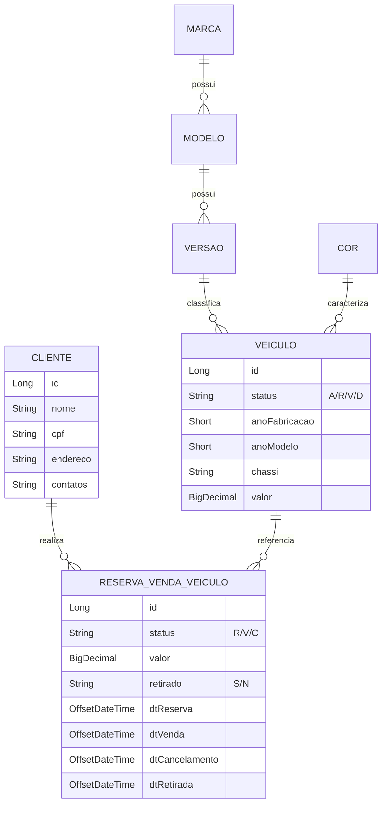
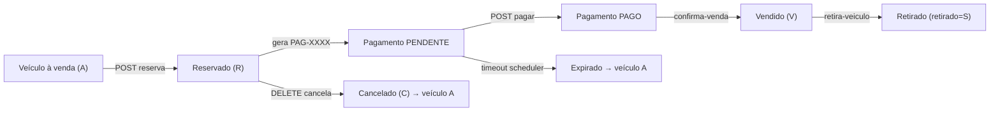

# API de Revenda de Veículos

API REST para uma plataforma de revenda de veículos automotores. Permite cadastrar o catálogo (marcas, modelos, versões e cores) e o estoque de veículos, registrar compradores e conduzir todo o processo de compra — da **reserva** à **retirada** do veículo, passando por **venda** e **cancelamento**.

> Projeto desenvolvido como parte do case de pós‑graduação (FASE 5). Os entregáveis de arquitetura, segurança de dados e orquestração SAGA estão em [`docs/FASE5-Entregaveis.md`](docs/FASE5-Entregaveis.md). A documentação técnica detalhada está em [`docs/DOCUMENTACAO.md`](docs/DOCUMENTACAO.md).

---

## Sumário

- [Funcionalidades](#funcionalidades)
- [Stack tecnológica](#stack-tecnológica)
- [Arquitetura da aplicação](#arquitetura-da-aplicação)
- [Modelo de domínio](#modelo-de-domínio)
- [Como executar](#como-executar)
- [Docker Compose (LocalStack + AWS simulado)](#docker-compose-localstack--aws-simulado)
- [Nuvem: qual provedor escolher?](#nuvem-qual-provedor-escolher)
- [Arquitetura implementada vs produção](#arquitetura-implementada-vs-produção)
- [Variáveis de ambiente](#variáveis-de-ambiente)
- [Deploy AWS (App Runner)](#deploy-aws-app-runner)
- [Endpoints principais](#endpoints-principais)
- [Fluxo de compra](#fluxo-de-compra)
- [Tratamento de erros](#tratamento-de-erros)
- [Estrutura de pastas](#estrutura-de-pastas)
- [Roadmap / melhorias sugeridas](#roadmap--melhorias-sugeridas)

---

## Funcionalidades

- **Catálogo:** CRUD de `Marca`, `Modelo`, `Versão` e `Cor` (hierarquia Marca → Modelo → Versão).
- **Estoque de veículos:** cadastrar, editar, listar e excluir veículos; listagem específica de **veículos à venda**.
- **Compradores:** CRUD de clientes com dados pessoais, endereço e contatos.
- **Processo de compra:** reserva → código de pagamento → confirmação de pagamento → venda → documentação de retirada → retirada; cancelamento e expiração automática com compensação (libera veículo).
- **SAGA interna:** orquestrador no monólito (`CompraSagaOrchestrator`) com etapas, idempotência e validação de pagamento antes da venda; eventos em Pub/Sub (GCP) ou SQS (LocalStack).
- **Autenticação JWT** com papéis (`ADMIN`, `VENDEDOR`, `OPERADOR`, `CLIENTE`) e `@PreAuthorize` nos endpoints sensíveis.
- **LGPD básico:** CPF validado/único, mascaramento na saída, logs SQL desligados.
- **Listagens do processo** ordenadas por preço: reservados, vendidos, cancelados, pendentes de retirada e retirados.
- **Relatórios de estoque** agregados por marca, marca/modelo e marca/modelo/versão (com quantidades disponível/reservada/vendida).
- **Tratamento de erros centralizado** com respostas padronizadas e validação de campos.

## Stack tecnológica

| Categoria | Tecnologia |
|---|---|
| Linguagem | Java 21 |
| Framework | Spring Boot 4.1.0 (Web MVC, Data JPA, Security, Validation, Actuator) |
| Segurança | Spring Security + OAuth2 Resource Server (JWT HMAC) |
| API Docs | springdoc-openapi 2.8.6 (Swagger UI) |
| Persistência | Spring Data JPA / Hibernate |
| Banco de dados | PostgreSQL (H2 em testes) |
| Mensageria (SAGA) | Pub/Sub (GCP produção) · AWS SQS (LocalStack local) |
| Build | Maven (`spring-boot-maven-plugin`) |
| Produtividade | Lombok, Spring Boot DevTools |
| Container | Docker multi-stage (Java 21) |

## Arquitetura da aplicação

A aplicação segue uma arquitetura em camadas com **dupla validação** (dados na borda + regras de negócio no serviço):

```
Controller ──> Validator de Dados (controller/validator)
     │
     v
  Service   ──> Validator de Negócio (service/validator)
     │
     v
 Repository (Spring Data JPA)
     │
     v
   Model (entidades JPA)
```

- **Controller:** expõe os endpoints REST, converte DTO ⇄ entidade e delega para o serviço.
- **Validator de Dados:** valida formato/obrigatoriedade e integridade básica antes de persistir.
- **Service:** orquestra a regra de negócio e a transação (`@Transactional`).
- **Validator de Negócio:** aplica regras do domínio (ex.: veículo já reservado, transições de status válidas).
- **Repository:** acesso a dados via Spring Data JPA (com algumas *native queries* para relatórios).
- **DTOs:** `...DtoEntrada` (records com Bean Validation) e `...DtoSaida` para entrada/saída.
- **Tratamento de erros:** `GlobalExceptionHandler` (`@RestControllerAdvice`) padroniza as respostas de erro.

## Modelo de domínio



**Estados (status):**

- `Veiculo.status`: `A` (à venda/ativo), `R` (reservado), `V` (vendido), `D` (desativado).
- `ReservaVendaVeiculo.status`: `R` (reservado), `V` (vendido), `C` (cancelado); `retirado`: `S`/`N`.

## Como executar

### Pré-requisitos

- JDK 21
- Maven 3.9+ (ou o wrapper `./mvnw`)
- PostgreSQL em execução

### 1. Banco de dados

A configuração padrão (`src/main/resources/application.yml`) espera:

```yaml
url:      jdbc:postgresql://localhost:5433/veiculos
username: postgres
password: postgres
```

Crie o banco (o schema é gerado/atualizado pelo Hibernate — `ddl-auto: update`):

```sql
CREATE DATABASE veiculos;
```

> Ajuste host, porta e credenciais conforme seu ambiente. **Recomendado:** externalizar a senha em variável de ambiente / secret manager (ver [roadmap](#roadmap--melhorias-sugeridas)).

> Credenciais via variáveis de ambiente (`.env.example`). JWT obrigatório — veja [autenticação](#autenticação).

### 2. Rodar localmente (Maven)

```bash
# Linux/macOS
./mvnw spring-boot:run

# Windows
mvnw.cmd spring-boot:run
```

A API sobe em **http://localhost:8083** (sem SQS/Lambda — use Docker Compose para simular AWS).

### 3. Build do artefato

```bash
./mvnw clean package
java -jar target/veiculos-0.0.1-SNAPSHOT.jar
```

### 4. Autenticação

Usuários iniciais (seed, apenas dev):

| Usuário | Senha | Papel |
|---|---|---|
| admin | admin123 | ADMIN |
| vendedor | vendedor123 | VENDEDOR |
| operador | operador123 | OPERADOR |
| cliente | cliente123 | CLIENTE |

```bash
curl -X POST http://localhost:8083/auth/login \
  -H "Content-Type: application/json" \
  -d '{"username":"admin","senha":"admin123"}'
# Use o token: Authorization: Bearer <token>
```

## Docker Compose (LocalStack + AWS simulado)

**Recomendado para demonstrar a FASE 5** sem custo de nuvem:

```bash
docker compose up --build
```

Sobe:
- **app** — API Spring Boot (porta 8083)
- **postgres** — PostgreSQL (porta 5433)
- **localstack** — simula SQS, Lambda, Secrets Manager, IAM, CloudWatch (porta 4566)

Ao criar uma reserva, a API publica eventos na fila `veiculos-eventos`. A **Lambda** `gerar-codigo-pagamento` consome a fila e registra um código fictício nos logs (evidência serverless).

Ver logs da Lambda no LocalStack:

```bash
docker logs veiculos-localstack 2>&1 | findstr gerar-codigo
```

## Nuvem: qual provedor escolher?

| Provedor | Mais fácil? | Mais barato? | Atende FASE 5? |
|---|---|---|---|
| **AWS (Beanstalk + LocalStack)** | **Sim** | **Sim (~US$ 8–15/mês)** | **Sim (completo)** |
| **Google Cloud (Cloud Run + Pub/Sub)** | **Sim** | **Sim (~US$ 8–18/mês, escala a zero)** | **Sim (completo)** |
| Azure Container Apps | Médio | Sim | Parcial (adaptar mensageria) |
| AWS ECS Fargate | Não | Médio | Sim (mais complexo) |

**Escolhas de deploy:**
- **AWS** — LocalStack local (grátis) + **Elastic Beanstalk** em produção
- **GCP** — Docker Compose local + **Cloud Run** em produção (trilha implementada)

## Arquitetura implementada vs produção

### AWS

| Componente | Local (Docker Compose) | Produção (AWS) |
|---|---|---|
| API monólito | Container `app` | **Elastic Beanstalk** (EC2 + ECR) |
| PostgreSQL | Container `postgres` | **RDS** (free tier) |
| SQS | **LocalStack** | **Amazon SQS** |
| Lambda | **LocalStack** | **AWS Lambda** |
| Secrets | **LocalStack** / env vars | **Secrets Manager** |
| Logs | LocalStack / stdout | **CloudWatch** |
| IAM | LocalStack | **IAM instance profile** Beanstalk |

### GCP

| Componente | Local (Docker Compose) | Produção (GCP) |
|---|---|---|
| API monólito | Container `app` | **Cloud Run** |
| PostgreSQL | Container `postgres` | **Cloud SQL** |
| Mensageria | **LocalStack SQS** | **Pub/Sub** |
| Serverless | **LocalStack Lambda** | **Cloud Function Gen2** |
| Secrets | env vars | **Secret Manager** |
| Logs | stdout | **Cloud Logging** (JSON) |
| Imagens | `docker build` local | **Artifact Registry** |

A aplicação **permanece um único Spring Boot** — publica/consome SQS internamente; não virou microserviço.

## Variáveis de ambiente

Copie [`.env.example`](.env.example) para `.env`. Principais:

| Variável | Descrição |
|---|---|
| `DB_URL`, `DB_USERNAME`, `DB_PASSWORD` | PostgreSQL |
| `JWT_SECRET` | Segredo HMAC (≥32 chars) |
| `AWS_ENABLED` | `true` no Docker Compose |
| `AWS_ENDPOINT` | `http://localstack:4566` (local) ou vazio (AWS real) |
| `AWS_SQS_ENABLED` | Habilita fila de eventos SAGA |

## Deploy AWS (Elastic Beanstalk)

> App Runner não aceita mais novos clientes (abr/2026). Guia atual:

- [`infra/elasticbeanstalk/DEPLOY.md`](infra/elasticbeanstalk/DEPLOY.md)
- Imagem ECR: `637423599009.dkr.ecr.us-east-1.amazonaws.com/veiculos-pos-tech:latest`
- Policy IAM EC2: [`infra/iam/policy-minima-beanstalk-ec2.json`](infra/iam/policy-minima-beanstalk-ec2.json)

## Deploy GCP (Cloud Run)

**Produção (veiculos-pos-tech):** https://veiculos-api-k4f2n37iga-uc.a.run.app

Guia completo: [`infra/gcp/DEPLOY.md`](infra/gcp/DEPLOY.md)

Scripts PowerShell (`infra/gcp/`):

| Script | Função |
|--------|--------|
| `setup-apis.ps1` | Habilita APIs GCP |
| `setup-artifact-registry.ps1` | Cria repositório Docker |
| `build-and-push.ps1` | Build + push da imagem |
| `setup-pubsub.ps1` | Tópico + IAM publisher |
| `deploy-function.ps1` | Cloud Function Gen2 |
| `deploy-cloud-run.ps1` | Deploy da API |

Documentação complementar: [`SECRETS.md`](infra/gcp/SECRETS.md) · [`FUNCTIONS.md`](infra/gcp/FUNCTIONS.md) · [`LOGGING.md`](infra/gcp/LOGGING.md)

## Endpoints principais

Base URL: `http://localhost:8083`

### Catálogo (CRUD padrão)

Os recursos abaixo seguem o mesmo padrão: `GET /`, `GET /{id}`, `POST /`, `PUT /{id}`, `DELETE /{id}`.

| Recurso | Base path |
|---|---|
| Marcas | `/marcas` |
| Modelos | `/modelos` |
| Versões | `/versoes` |
| Cores | `/cores` |

### Veículos — `/veiculos`

| Método | Rota | Descrição |
|---|---|---|
| GET | `/veiculos` | Lista todos os veículos |
| GET | `/veiculos/{id}` | Obtém um veículo |
| GET | `/veiculos/a-venda` | Lista veículos disponíveis para venda |
| POST | `/veiculos` | Cadastra um veículo |
| PUT | `/veiculos/{id}` | Edita um veículo |
| DELETE | `/veiculos/{id}` | Exclui um veículo |

### Clientes — `/clientes`

| Método | Rota | Descrição |
|---|---|---|
| GET | `/clientes` | Lista clientes |
| GET | `/clientes/{id}` | Obtém um cliente |
| POST | `/clientes` | Cadastra um comprador |
| PUT | `/clientes/{id}` | Edita um cliente |
| DELETE | `/clientes/{id}` | Exclui um cliente |

### Pagamentos — `/pagamentos`

| Método | Rota | Descrição |
|---|---|---|
| GET | `/pagamentos` | Lista pagamentos |
| GET | `/pagamentos/{id}` | Obtém por id |
| GET | `/pagamentos/codigo/{codigo}` | Obtém por código (`PAG-XXXXXXXX`) |
| GET | `/pagamentos/reserva/{reservaId}` | Pagamentos de uma reserva |
| POST | `/pagamentos/gerar/{reservaId}` | Gera código de pagamento (também gerado na reserva) |
| POST | `/pagamentos/pagar/{codigo}` | Confirma pagamento fictício |

### Reserva / Venda — `/reserva-venda-veiculos`

| Método | Rota | Descrição |
|---|---|---|
| POST | `/reserva-venda-veiculos` | Cria a **reserva** de um veículo (retorna o código da reserva) |
| PUT | `/reserva-venda-veiculos/{id}` | Altera uma reserva |
| DELETE | `/reserva-venda-veiculos/confirma-venda/{id}` | **Confirma a venda** |
| DELETE | `/reserva-venda-veiculos/retira-veiculo/{id}` | Registra a **retirada** do veículo |
| DELETE | `/reserva-venda-veiculos/{id}` | **Cancela** a reserva/venda |
| GET | `/reserva-venda-veiculos` | Lista reservas/vendas/cancelamentos |
| GET | `/reserva-venda-veiculos/reservados` | Lista reservados (ordenado por preço) |
| GET | `/reserva-venda-veiculos/vendidos` | Lista vendidos (ordenado por preço) |
| GET | `/reserva-venda-veiculos/cancelados` | Lista cancelados (ordenado por preço) |
| GET | `/reserva-venda-veiculos/pendentes-de-retirada` | Vendidos ainda não retirados |
| GET | `/reserva-venda-veiculos/retirados` | Vendidos já retirados |
| GET | `/reserva-venda-veiculos/marca` | Estoque agregado por marca |
| GET | `/reserva-venda-veiculos/marca-modelo` | Estoque agregado por marca/modelo |
| GET | `/reserva-venda-veiculos/marca-modelo-versao` | Estoque agregado por marca/modelo/versão |
| GET | `/reserva-venda-veiculos/marca-modelo-versao-qtde-estoque` | Quantidade disponível por versão |

### Exemplos

Cadastrar veículo:

```bash
curl -X POST http://localhost:8083/veiculos \
  -H "Content-Type: application/json" \
  -d '{
    "corId": 1,
    "versaoId": 1,
    "anoFabricacao": 2023,
    "anoModelo": 2024,
    "chassi": "9BWZZZ377VT004251",
    "valor": 89900.00
  }'
```

Reservar veículo (compra):

```bash
curl -X POST http://localhost:8083/reserva-venda-veiculos \
  -H "Content-Type: application/json" \
  -d '{ "veiculoId": 1, "clienteId": 1, "valor": 89900.00 }'
```

## Fluxo de compra



Regras de negócio (validators + `CompraSagaOrchestrator`):

- Reserva exige cliente **cadastrado e ativo**, veículo disponível e valor igual ao cadastrado.
- **Venda só após pagamento PAGO** — a SAGA bloqueia `confirma-venda` sem pagamento confirmado.
- Reservas/pagamentos expiram após `app.reserva.minutos-expiracao` (padrão 30 min); scheduler libera o veículo.
- Retirada só para reservas `V` não retiradas; gera registro `DOC-XXXXXXXX` de documentação.
- Cancelamento devolve o veículo ao estoque (`status = A`).

## Observabilidade e documentação interativa

| Recurso | URL |
|---|---|
| Swagger UI | http://localhost:8083/swagger-ui.html |
| OpenAPI JSON | http://localhost:8083/v3/api-docs |
| Health | http://localhost:8083/actuator/health |
| Info | http://localhost:8083/actuator/info |

## Testes

```bash
./mvnw test
```

Cobertura principal:
- `CompraSagaOrchestratorTest` — unitário (transições e validações da SAGA)
- `CompraFluxoIntegrationTest` — integração do fluxo reserva → pagamento → venda → retirada/cancelamento

## Tratamento de erros

As respostas de erro são padronizadas pelo `GlobalExceptionHandler`. Exceções de negócio disponíveis:

| Exceção | Situação |
|---|---|
| `RegistroDuplicadoException` | Registro já existente (409 Conflict) |
| `RegistroSemIntegridadeException` | Violação de integridade referencial de negócio (409) |
| `RegistroNaoEncontradoException` | Registro/ID não encontrado (400) |
| `RegistroNaoEnviadoException` | Dado obrigatório não informado (400) |
| `CampoInvalidoException` | Campo inválido (validação) |
| `OperacaoNaoPemitidaExecption` | Operação não permitida (400) |
| `ErroGeralException` | Erro de regra de negócio genérico (409) |

Erros de validação de Bean Validation retornam a lista de campos inválidos com mensagens amigáveis.

## Estrutura de pastas

```
src/main/java/com/example/veiculo/
├── VeiculoApplication.java
├── controller/                      # REST (Auth, Pagamento, Reserva, …)
├── service/                         # regras de negócio + transações
├── saga/                            # CompraSagaOrchestrator, SagaEtapa
├── messaging/                       # SagaEventBus, SqsEventPublisher/Consumer
├── scheduler/                       # expiração automática de reservas
├── repository/                      # Spring Data JPA
├── model/                           # entidades (Pagamento, SagaCompra, Usuario, …)
├── dto/
└── geral/
    ├── config/                      # Security, AWS, OpenAPI, CpfUtil
    └── security/                    # TokenService, UsuarioSeeder
infra/
├── localstack/init-aws.sh           # SQS, Lambda, Secrets (local)
├── lambda/gerar-codigo-pagamento/   # função serverless de exemplo
├── elasticbeanstalk/DEPLOY.md       # guia deploy atual (Beanstalk)
└── apprunner/DEPLOY.md              # legado (App Runner descontinuado)
docs/
├── FASE5-Entregaveis.md
└── DOCUMENTACAO.md
```

## Roadmap / pendências

- [x] Código de pagamento, expiração, documentação de retirada
- [x] Segurança JWT + papéis + LGPD básico
- [x] Docker Compose + LocalStack + Lambda + SQS
- [x] SAGA orquestrador interno + eventos SQS
- [x] Actuator + OpenAPI/Swagger
- [x] Testes automatizados do fluxo de compra (8 testes)
- [ ] Deploy real Elastic Beanstalk (evidência — seguir `infra/elasticbeanstalk/DEPLOY.md`)
- [ ] Vínculo usuário autenticado ↔ cliente (CLIENTE opera só suas reservas)
- [ ] PDF final exportado a partir de `docs/FASE5-Entregaveis.md`
