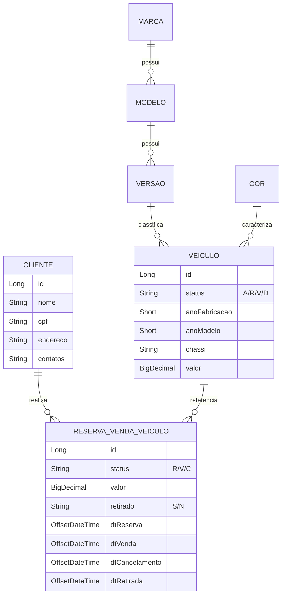
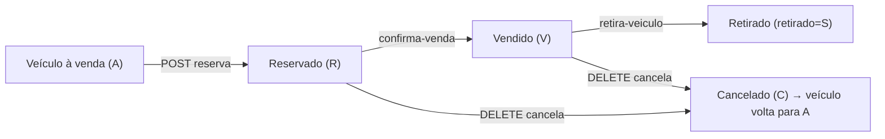

# API de Revenda de Veículos

API REST para uma plataforma de revenda de veículos automotores. Permite cadastrar o catálogo (marcas, modelos, versões e cores) e o estoque de veículos, registrar compradores e conduzir todo o processo de compra — da **reserva** à **retirada** do veículo, passando por **venda** e **cancelamento**.

> Projeto desenvolvido como parte do case de pós‑graduação (FASE 5). Os entregáveis de arquitetura, segurança de dados e orquestração SAGA estão em [`docs/FASE5-Entregaveis.md`](docs/FASE5-Entregaveis.md). A documentação técnica detalhada está em [`docs/DOCUMENTACAO.md`](docs/DOCUMENTACAO.md).

---

## Sumário

- [Funcionalidades](#funcionalidades)
- [Stack tecnológica](#stack-tecnológica)
- [Arquitetura da aplicação](#arquitetura-da-aplicação)
- [Modelo de domínio](#modelo-de-domínio)
- [Como executar](#como-executar)
- [Endpoints principais](#endpoints-principais)
- [Fluxo de compra](#fluxo-de-compra)
- [Tratamento de erros](#tratamento-de-erros)
- [Estrutura de pastas](#estrutura-de-pastas)
- [Roadmap / melhorias sugeridas](#roadmap--melhorias-sugeridas)

---

## Funcionalidades

- **Catálogo:** CRUD de `Marca`, `Modelo`, `Versão` e `Cor` (hierarquia Marca → Modelo → Versão).
- **Estoque de veículos:** cadastrar, editar, listar e excluir veículos; listagem específica de **veículos à venda**.
- **Compradores:** CRUD de clientes com dados pessoais, endereço e contatos.
- **Processo de compra:** reserva de veículo, confirmação de venda, retirada e cancelamento — com controle de estados no veículo e na reserva.
- **Listagens do processo** ordenadas por preço: reservados, vendidos, cancelados, pendentes de retirada e retirados.
- **Relatórios de estoque** agregados por marca, marca/modelo e marca/modelo/versão (com quantidades disponível/reservada/vendida).
- **Tratamento de erros centralizado** com respostas padronizadas e validação de campos.

## Stack tecnológica

| Categoria | Tecnologia |
|---|---|
| Linguagem | Java 21 |
| Framework | Spring Boot 4.1.0 (Web MVC, Data JPA, Security, Validation) |
| Persistência | Spring Data JPA / Hibernate |
| Banco de dados | PostgreSQL |
| Build | Maven (`spring-boot-maven-plugin`) |
| Produtividade | Lombok, Spring Boot DevTools |

## Arquitetura da aplicação

A aplicação segue uma arquitetura em camadas com **dupla validação** (dados na borda + regras de negócio no serviço):

```
Controller ──> Validator de Dados (controller/validator)
     │
     v
  Service   ──> Validator de Negócio (service/validator)
     │
     v
 Repository (Spring Data JPA)
     │
     v
   Model (entidades JPA)
```

- **Controller:** expõe os endpoints REST, converte DTO ⇄ entidade e delega para o serviço.
- **Validator de Dados:** valida formato/obrigatoriedade e integridade básica antes de persistir.
- **Service:** orquestra a regra de negócio e a transação (`@Transactional`).
- **Validator de Negócio:** aplica regras do domínio (ex.: veículo já reservado, transições de status válidas).
- **Repository:** acesso a dados via Spring Data JPA (com algumas *native queries* para relatórios).
- **DTOs:** `...DtoEntrada` (records com Bean Validation) e `...DtoSaida` para entrada/saída.
- **Tratamento de erros:** `GlobalExceptionHandler` (`@RestControllerAdvice`) padroniza as respostas de erro.

## Modelo de domínio



**Estados (status):**

- `Veiculo.status`: `A` (à venda/ativo), `R` (reservado), `V` (vendido), `D` (desativado).
- `ReservaVendaVeiculo.status`: `R` (reservado), `V` (vendido), `C` (cancelado); `retirado`: `S`/`N`.

## Como executar

### Pré-requisitos

- JDK 21
- Maven 3.9+ (ou o wrapper `./mvnw`)
- PostgreSQL em execução

### 1. Banco de dados

A configuração padrão (`src/main/resources/application.yml`) espera:

```yaml
url:      jdbc:postgresql://localhost:5433/veiculos
username: postgres
password: postgres
```

Crie o banco (o schema é gerado/atualizado pelo Hibernate — `ddl-auto: update`):

```sql
CREATE DATABASE veiculos;
```

> Ajuste host, porta e credenciais conforme seu ambiente. **Recomendado:** externalizar a senha em variável de ambiente / secret manager (ver [roadmap](#roadmap--melhorias-sugeridas)).

### 2. Rodar a aplicação

```bash
# Linux/macOS
./mvnw spring-boot:run

# Windows
mvnw.cmd spring-boot:run
```

A API sobe em **http://localhost:8083**.

### 3. Build do artefato

```bash
./mvnw clean package
java -jar target/veiculos-0.0.1-SNAPSHOT.jar
```

## Endpoints principais

Base URL: `http://localhost:8083`

### Catálogo (CRUD padrão)

Os recursos abaixo seguem o mesmo padrão: `GET /`, `GET /{id}`, `POST /`, `PUT /{id}`, `DELETE /{id}`.

| Recurso | Base path |
|---|---|
| Marcas | `/marcas` |
| Modelos | `/modelos` |
| Versões | `/versoes` |
| Cores | `/cores` |

### Veículos — `/veiculos`

| Método | Rota | Descrição |
|---|---|---|
| GET | `/veiculos` | Lista todos os veículos |
| GET | `/veiculos/{id}` | Obtém um veículo |
| GET | `/veiculos/a-venda` | Lista veículos disponíveis para venda |
| POST | `/veiculos` | Cadastra um veículo |
| PUT | `/veiculos/{id}` | Edita um veículo |
| DELETE | `/veiculos/{id}` | Exclui um veículo |

### Clientes — `/clientes`

| Método | Rota | Descrição |
|---|---|---|
| GET | `/clientes` | Lista clientes |
| GET | `/clientes/{id}` | Obtém um cliente |
| POST | `/clientes` | Cadastra um comprador |
| PUT | `/clientes/{id}` | Edita um cliente |
| DELETE | `/clientes/{id}` | Exclui um cliente |

### Reserva / Venda — `/reserva-venda-veiculos`

| Método | Rota | Descrição |
|---|---|---|
| POST | `/reserva-venda-veiculos` | Cria a **reserva** de um veículo (retorna o código da reserva) |
| PUT | `/reserva-venda-veiculos/{id}` | Altera uma reserva |
| DELETE | `/reserva-venda-veiculos/confirma-venda/{id}` | **Confirma a venda** |
| DELETE | `/reserva-venda-veiculos/retira-veiculo/{id}` | Registra a **retirada** do veículo |
| DELETE | `/reserva-venda-veiculos/{id}` | **Cancela** a reserva/venda |
| GET | `/reserva-venda-veiculos` | Lista reservas/vendas/cancelamentos |
| GET | `/reserva-venda-veiculos/reservados` | Lista reservados (ordenado por preço) |
| GET | `/reserva-venda-veiculos/vendidos` | Lista vendidos (ordenado por preço) |
| GET | `/reserva-venda-veiculos/cancelados` | Lista cancelados (ordenado por preço) |
| GET | `/reserva-venda-veiculos/pendentes-de-retirada` | Vendidos ainda não retirados |
| GET | `/reserva-venda-veiculos/retirados` | Vendidos já retirados |
| GET | `/reserva-venda-veiculos/marca` | Estoque agregado por marca |
| GET | `/reserva-venda-veiculos/marca-modelo` | Estoque agregado por marca/modelo |
| GET | `/reserva-venda-veiculos/marca-modelo-versao` | Estoque agregado por marca/modelo/versão |
| GET | `/reserva-venda-veiculos/marca-modelo-versao-qtde-estoque` | Quantidade disponível por versão |

### Exemplos

Cadastrar veículo:

```bash
curl -X POST http://localhost:8083/veiculos \
  -H "Content-Type: application/json" \
  -d '{
    "corId": 1,
    "versaoId": 1,
    "anoFabricacao": 2023,
    "anoModelo": 2024,
    "chassi": "9BWZZZ377VT004251",
    "valor": 89900.00
  }'
```

Reservar veículo (compra):

```bash
curl -X POST http://localhost:8083/reserva-venda-veiculos \
  -H "Content-Type: application/json" \
  -d '{ "veiculoId": 1, "clienteId": 1, "valor": 89900.00 }'
```

## Fluxo de compra



Regras de negócio já aplicadas (em `ReservaVendaVeiculoNegocioValidator`):

- Só é possível reservar um veículo existente, de um cliente existente e com valor igual ao cadastrado.
- Não é possível reservar um veículo que já esteja reservado (`R`) ou vendido (`V`).
- Retirada só é permitida para reservas com status `V` e que ainda não foram retiradas.
- Cancelamento devolve o veículo ao estoque (`status = A`).

## Tratamento de erros

As respostas de erro são padronizadas pelo `GlobalExceptionHandler`. Exceções de negócio disponíveis:

| Exceção | Situação |
|---|---|
| `RegistroDuplicadoException` | Registro já existente (409 Conflict) |
| `RegistroSemIntegridadeException` | Violação de integridade referencial de negócio (409) |
| `RegistroNaoEncontradoException` | Registro/ID não encontrado (400) |
| `RegistroNaoEnviadoException` | Dado obrigatório não informado (400) |
| `CampoInvalidoException` | Campo inválido (validação) |
| `OperacaoNaoPemitidaExecption` | Operação não permitida (400) |
| `ErroGeralException` | Erro de regra de negócio genérico (409) |

Erros de validação de Bean Validation retornam a lista de campos inválidos com mensagens amigáveis.

## Estrutura de pastas

```
src/main/java/com/example/veiculo/
├── VeiculoApplication.java          # bootstrap Spring Boot
├── controller/                      # endpoints REST
│   └── validator/                   # validação de dados (borda)
├── service/                         # regras de negócio + transações
│   └── validator/                   # validação de negócio
├── repository/                      # Spring Data JPA
├── model/                           # entidades JPA
├── dto/                             # DTOs de entrada/saída por agregado
└── geral/
    ├── config/                      # SecurityConfiguration, Libs, exceptions
    │   └── exception/               # GlobalExceptionHandler, Problem, tipos
    └── generic/                     # utilitários de controller
docs/
├── FASE5-Entregaveis.md             # arquitetura, segurança de dados e SAGA
└── DOCUMENTACAO.md                  # documentação técnica detalhada
```

## Roadmap / melhorias sugeridas

Itens mapeados na análise do projeto (detalhados em [`docs/DOCUMENTACAO.md`](docs/DOCUMENTACAO.md) e [`docs/FASE5-Entregaveis.md`](docs/FASE5-Entregaveis.md)):

- **Segurança:** hoje o `SecurityConfiguration` está com `anyRequest().permitAll()`. Habilitar autenticação (JWT/Cognito) e autorização por papel (`@PreAuthorize`), já que `@EnableMethodSecurity` está ativo.
- **Dados sensíveis (LGPD):** criptografar/mascarar CPF e contatos; tornar o **CPF único e validado** (hoje o campo único é `nome`).
- **Segredos:** remover a senha do banco do `application.yml` e usar variáveis de ambiente / secret manager.
- **Processo de compra:** adicionar geração de **código de pagamento** e *timeout* de reserva (orquestração SAGA — ver documento da FASE 5).
- **Padronização:** revisar nomes com typos (`ReervaVendaVeiculo`, `OperacaoNaoPemitidaExecption`) e o handler genérico que responde `204 No Content` para `Exception`.
- **Documentação de API:** incluir Springdoc/OpenAPI (Swagger UI).
- **Testes:** adicionar testes de integração para o fluxo de compra.
```
