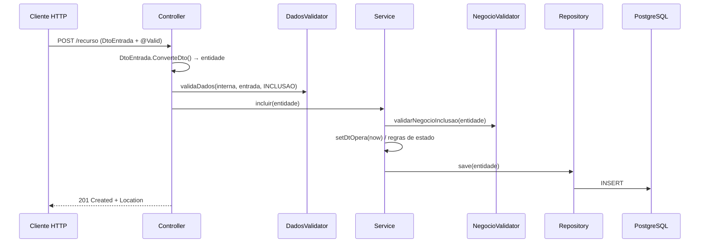
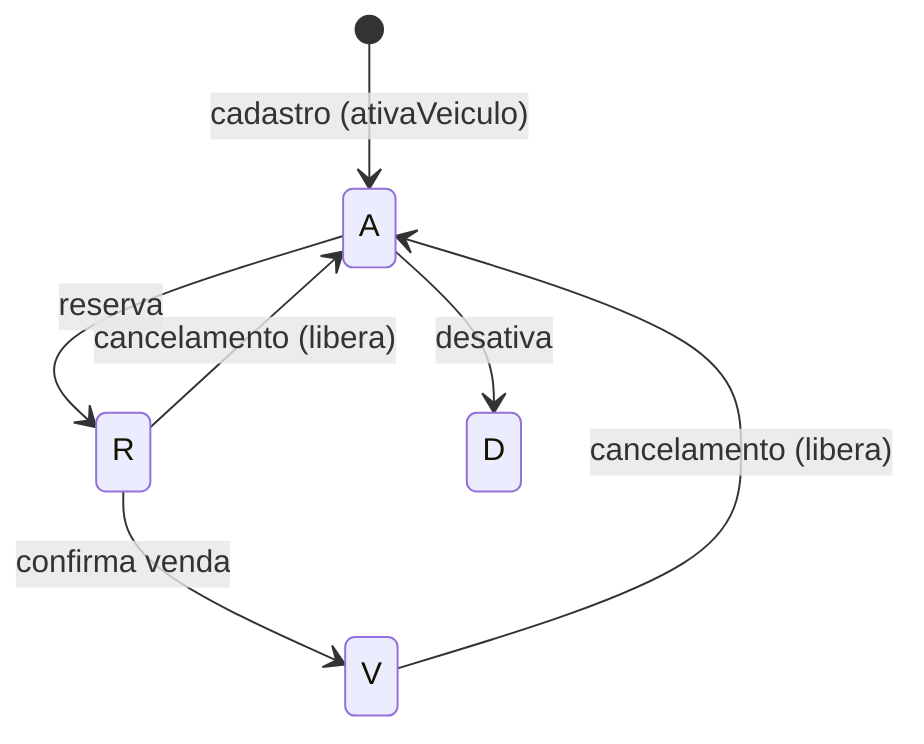
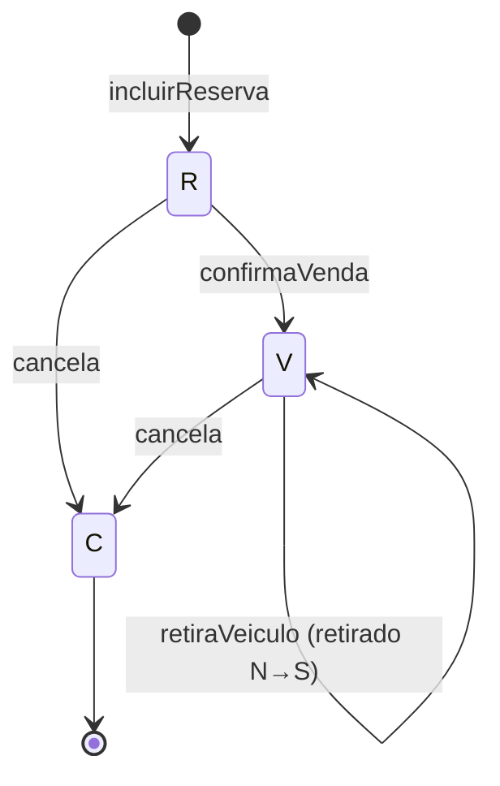

# Documentação Técnica — API de Revenda de Veículos

Documento de referência técnica do projeto. Complementa o [`README.md`](../README.md) (visão geral / como rodar) e o [`FASE5-Entregaveis.md`](FASE5-Entregaveis.md) (arquitetura em nuvem, segurança de dados e SAGA).

## Índice

1. [Visão geral](#1-visão-geral)
2. [Organização do código](#2-organização-do-código)
3. [Fluxo de uma requisição](#3-fluxo-de-uma-requisição)
4. [Modelo de dados](#4-modelo-de-dados)
5. [Máquinas de estado](#5-máquinas-de-estado)
6. [Regras de negócio](#6-regras-de-negócio)
7. [Orquestração SAGA interna](#7-orquestração-saga-interna)
8. [Referência da API](#8-referência-da-api)
9. [Contratos (DTOs)](#9-contratos-dtos)
10. [Tratamento de erros](#10-tratamento-de-erros)
11. [Configuração](#11-configuração)
12. [Segurança](#12-segurança)
13. [Nuvem e mensageria](#13-nuvem-e-mensageria)
14. [Observabilidade](#14-observabilidade)
15. [Análise técnica e pontos de atenção](#15-análise-técnica-e-pontos-de-atenção)

---

## 1. Visão geral

API REST em **Spring Boot 4.1 / Java 21** para uma revenda de veículos. Cobre três blocos:

- **Catálogo** — dados de referência: `Marca`, `Modelo`, `Versao`, `Cor`.
- **Estoque** — `Veiculo` (associado a uma versão e a uma cor).
- **Compra** — `Cliente` (comprador) e `ReservaVendaVeiculo` (a transação que conduz reserva → venda → retirada, ou cancelamento).

Persistência com Spring Data JPA/Hibernate sobre PostgreSQL. Auditoria de data via `@EntityListeners(AuditingEntityListener.class)` e `@EnableJpaAuditing`.

## 2. Organização do código

Pacote raiz: `com.example.veiculo`

| Pacote | Responsabilidade |
|---|---|
| `controller` | Endpoints REST (um controller por agregado). |
| `controller.validator` | Validação de **dados** (formato, obrigatoriedade, integridade de entrada). |
| `service` | Regras de negócio e transações (`@Transactional`). |
| `service.validator` | Validação de **negócio** (transições de estado, duplicidade, integridade referencial). |
| `repository` | Interfaces Spring Data JPA; *native queries* para relatórios agregados. |
| `model` | Entidades JPA. |
| `dto.<Agregado>` | `...DtoEntrada` (records com Bean Validation) e `...DtoSaida`. |
| `geral.config` | `SecurityConfiguration`, `AwsProperties`, `OpenApiConfiguration`, `CpfUtil`, exceções. |
| `geral.security` | `TokenService`, `UsuarioDetailsService`, `UsuarioSeeder`. |
| `saga` | `CompraSagaOrchestrator`, `SagaEtapa`, `SagaStatus`. |
| `messaging` | `SagaEventBus`, `SqsEventPublisher`, `SqsEventConsumer`. |
| `scheduler` | `ReservaExpiracaoScheduler` (expiração automática). |
| `geral.config.exception` | `GlobalExceptionHandler`, `Problem`, `ProblemType`, exceções personalizadas. |
| `geral.generic` | `GenerciController` (geração de header `Location`). |

Padrão de nomenclatura por agregado: `XxxController` → `XxxDadosValidator` → `XxxService` → `XxxNegocioValidator` → `XxxRepository` → `Xxx` (model), com `XxxDtoEntrada`/`XxxDtoSaida`.

## 3. Fluxo de uma requisição

Exemplo de inclusão (`POST`), válido para todos os agregados:



- **Bean Validation (`@Valid`)** dispara nas `record`s de entrada; erros vão para `handleMethodArgumentNotValid`.
- **DadosValidator** roda regras de borda antes do serviço.
- **NegocioValidator** roda dentro do serviço, na transação.

## 4. Modelo de dados

### Entidades de catálogo

| Entidade | Campos | Observações |
|---|---|---|
| `Marca` | `id`, `nome` (único), `dtOpera` | Raiz do catálogo. |
| `Modelo` | `id`, `nome` (único), `marca` (ManyToOne), `dtOpera` | Pertence a uma marca. |
| `Versao` | `id`, `nome` (único), `modelo` (ManyToOne), `dtOpera` | Pertence a um modelo. |
| `Cor` | `id`, `nome` (único), `dtOpera` | Independente. |

### Estoque

| `Veiculo` | Tipo | Observações |
|---|---|---|
| `id` | Long | PK |
| `status` | String(1) | `A`/`R`/`V`/`D` |
| `anoFabricacao` | Short | |
| `anoModelo` | Short | |
| `chassi` | String(17) | |
| `valor` | BigDecimal(9,2) | |
| `versao` | Versao (ManyToOne, LAZY) | obrigatório |
| `cor` | Cor (ManyToOne, LAZY) | obrigatório |
| `dtOpera` | OffsetDateTime | data da operação |

### Comprador

| `Cliente` | Tipo | Classificação LGPD |
|---|---|---|
| `id` | Long | — |
| `nome` | String(70), **único** | Pessoal |
| `cpf` | String(11), **único**, validado | **Pessoal crítico** — mascarado na saída |
| `ativo` | Boolean | Cliente habilitado para compra |
| `logradouro`,`numero`,`complemento`,`bairro`,`cidade`,`estado`,`cep` | String | Pessoal (endereço) |
| `celular`,`foneFixo`,`email` | String | Pessoal (contato) |
| `dtOpera` | OffsetDateTime | — |

### Transação de compra

| `ReservaVendaVeiculo` | Tipo | Observações |
|---|---|---|
| `id` | Long | "código da reserva" retornado no POST |
| `status` | String(1) | `R`/`V`/`C` |
| `valor` | BigDecimal(9,2) | deve bater com o valor do veículo |
| `cliente` | Cliente (ManyToOne) | obrigatório |
| `veiculo` | Veiculo (ManyToOne) | obrigatório |
| `dtReserva`,`dtVenda`,`dtCancelamento`,`dtRetirada` | OffsetDateTime | marcos do processo |
| `retirado` | String(1) | `S`/`N` |
| `dtOpera` | OffsetDateTime | data da operação |

Métodos de conveniência da entidade: `reservaVeiculo()`, `vendaVeiculo()`, `cancelaVeiculo()`, `retiradaVeiculo()`.

### Pagamento

| `Pagamento` | Tipo | Observações |
|---|---|---|
| `id` | Long | PK |
| `codigo` | String | `PAG-XXXXXXXX` (fictício) |
| `valor` | BigDecimal | Valor da reserva |
| `status` | StatusPagamento | `PENDENTE` / `PAGO` / `EXPIRADO` / `CANCELADO` |
| `reserva` | ReservaVendaVeiculo | ManyToOne |
| `dtGeracao`, `dtPagamento`, `dtExpiracao` | OffsetDateTime | Marcos temporais |

### Documentação de retirada

| `DocumentacaoRetirada` | Tipo | Observações |
|---|---|---|
| `codigo` | String | `DOC-XXXXXXXX` |
| `status` | StatusDocumentacao | `GERADA` / `ENTREGUE` |
| `reserva` | ReservaVendaVeiculo | ManyToOne |

### SAGA de compra

| `SagaCompra` | Tipo | Observações |
|---|---|---|
| `reservaId` | Long | FK lógica para a reserva |
| `etapa` | SagaEtapa | Etapa atual da orquestração |
| `status` | SagaStatus | `EM_ANDAMENTO` / `CONCLUIDA` / `COMPENSADA` |
| `dtOperacao` | OffsetDateTime | Última transição |

### Autenticação

| `Usuario` | Tipo | Observações |
|---|---|---|
| `username` | String, único | Login |
| `senha` | String | BCrypt |
| `role` | Role | `ADMIN` / `VENDEDOR` / `OPERADOR` / `CLIENTE` |

## 5. Máquinas de estado

### Veículo



### Reserva/Venda



## 6. Regras de negócio

Concentradas em `ReservaVendaVeiculoNegocioValidator` e `ReservaVendaVeiculoService`:

**Inclusão de reserva (`validarNegocioInclusao`)**
- Veículo deve existir (`veiculoRepository.existsById`).
- Cliente deve existir (`clienteRepository.existsById`) → atende "venda somente para compradores cadastrados".
- Valor informado deve ser igual ao valor cadastrado do veículo.
- Não pode haver reserva `R` nem venda `V` para o mesmo veículo.
- Ao reservar: `Reserva.status = R`, `retirado = N`, `dtReserva = now`; o `Veiculo` passa a `R`.

**Alteração (`validarNegocioAlteracao`)**
- Mesmas validações de integridade; só permite alterar reservas com status `R`.

**Confirmação de venda (`confirmaVenda`)**
- Só permite quando status atual é `R`.
- **`CompraSagaOrchestrator.validarPodeConfirmarVenda`** exige pagamento com status `PAGO`.
- Grava `dtVenda`, `Reserva.status = V` e `Veiculo.status = V`.

**Retirada (`retiraVeiculo`)**
- Só permite quando status é `V` e ainda não retirado; marca `retirado = S`, `dtRetirada`.
- Gera `DocumentacaoRetirada` com código `DOC-XXXXXXXX`.

**Cancelamento (`cancela`)**
- Só permite quando status é `R` ou `V`; grava `dtCancelamento`, `Reserva.status = C`, devolve `Veiculo` para `A`.
- Cancela pagamento pendente associado.

**Expiração (`PagamentoService.expirarVencidos`)**
- Scheduler (`ReservaExpiracaoScheduler`) verifica pagamentos/reservas vencidos.
- Marca pagamento `EXPIRADO`, cancela reserva e libera veículo (`A`).
- SAGA registra etapa `EXPIRADA`.

> Operações de compra usam `@Transactional`; status do veículo é persistido explicitamente via `veiculoRepository.save()`.

## 7. Orquestração SAGA interna

A SAGA roda **dentro do monólito** via `CompraSagaOrchestrator`, sem microserviços. Eventos assíncronos são publicados em SQS (LocalStack/AWS) para evidência serverless.

### Etapas (`SagaEtapa`)

```
RESERVA → PAGAMENTO_GERADO → PAGAMENTO_CONFIRMADO → VENDA → DOCUMENTACAO → RETIRADA
                                    ↓ cancelamento / expiração
                              CANCELADA / EXPIRADA (compensação)
```

### Garantias implementadas

- **Idempotência:** reprocessar a mesma etapa não retrocede o estado.
- **Pagamento antes da venda:** `validarPodeConfirmarVenda` bloqueia venda sem `PAGO`.
- **Compensação:** cancelamento e expiração liberam o veículo e atualizam a SAGA.
- **Eventos:** `SagaEventBus` publica `RESERVA_CRIADA`, `PAGAMENTO_GERADO`, `PAGAMENTO_CONFIRMADO`, `VENDA_CONFIRMADA`, `RETIRADA`, `CANCELADA`, `EXPIRADA` na fila SQS quando habilitada.

## 8. Referência da API

Base: `http://localhost:8083`

### Recursos de catálogo (CRUD idêntico)

`/marcas`, `/modelos`, `/versoes`, `/cores`:

| Método | Rota | Status sucesso |
|---|---|---|
| GET | `/{recurso}` | 200 |
| GET | `/{recurso}/{id}` | 200 / 404 |
| POST | `/{recurso}` | 201 + `Location` |
| PUT | `/{recurso}/{id}` | 204 / 404 |
| DELETE | `/{recurso}/{id}` | 204 / 404 |

### `/veiculos`

| Método | Rota | Descrição |
|---|---|---|
| GET | `/veiculos` | Lista todos |
| GET | `/veiculos/{id}` | Obtém por id |
| GET | `/veiculos/a-venda` | Somente disponíveis (`status = A`) |
| POST | `/veiculos` | Inclui (201 + Location) |
| PUT | `/veiculos/{id}` | Altera (204) |
| DELETE | `/veiculos/{id}` | Exclui (204) |

### `/clientes`

| Método | Rota | Descrição |
|---|---|---|
| GET | `/clientes` | Lista |
| GET | `/clientes/{id}` | Obtém |
| POST | `/clientes` | Inclui (201 + Location) |
| PUT | `/clientes/{id}` | Altera (204) |
| DELETE | `/clientes/{id}` | Exclui (204) |

### `/auth`

| Método | Rota | Descrição |
|---|---|---|
| POST | `/auth/login` | Autentica e retorna JWT (público) |

Corpo: `{ "username": "admin", "senha": "admin123" }`. Resposta inclui `token` e `tipo: Bearer`.

### `/pagamentos`

| Método | Rota | Descrição |
|---|---|---|
| GET | `/pagamentos` | Lista pagamentos |
| GET | `/pagamentos/{id}` | Obtém por id |
| GET | `/pagamentos/codigo/{codigo}` | Obtém por código |
| GET | `/pagamentos/reserva/{reservaId}` | Pagamentos de uma reserva |
| POST | `/pagamentos/gerar/{reservaId}` | Gera código (roles: CLIENTE, VENDEDOR, ADMIN) |
| POST | `/pagamentos/pagar/{codigo}` | Confirma pagamento fictício |

### `/reserva-venda-veiculos`

**Comandos do processo**

| Método | Rota | Efeito |
|---|---|---|
| POST | `/` | Cria reserva; retorna `201` com corpo `"Código da Reserva: {id}"` |
| PUT | `/{id}` | Altera reserva (204) |
| DELETE | `/confirma-venda/{id}` | Confirma venda (204) |
| DELETE | `/retira-veiculo/{id}` | Registra retirada (204) |
| DELETE | `/{id}` | Cancela (204) |

**Consultas (ordenadas por preço)**

| Método | Rota | Descrição |
|---|---|---|
| GET | `/` | Todas (reservados/vendidos/cancelados) |
| GET | `/{id}` | Uma reserva |
| GET | `/reservados` | Status `R` |
| GET | `/vendidos` | Status `V` |
| GET | `/cancelados` | Status `C` |
| GET | `/pendentes-de-retirada` | `V` e `retirado = N` |
| GET | `/retirados` | `V` e `retirado = S` |

**Relatórios de estoque (native queries)**

| Método | Rota | Descrição |
|---|---|---|
| GET | `/marca` | Agregado por marca (disponível/reservada/vendida/total) |
| GET | `/marca-modelo` | Agregado por marca+modelo |
| GET | `/marca-modelo-versao` | Agregado por marca+modelo+versão |
| GET | `/marca-modelo-versao-qtde-estoque` | Quantidade disponível (`status = A`) por versão |

## 9. Contratos (DTOs)

### `VeiculoDtoEntrada`

```json
{
  "corId": 1,
  "versaoId": 1,
  "anoFabricacao": 2023,
  "anoModelo": 2024,
  "chassi": "9BWZZZ377VT004251",
  "valor": 89900.00
}
```
Validações: `corId`/`versaoId` obrigatórios; `chassi` entre 10 e 17; `valor` até 9 inteiros e 2 decimais.

### `ClienteDtoEntrada`

```json
{
  "nome": "Maria Silva",
  "cpf": "12345678901",
  "logradouro": "Rua A", "numero": "100", "complemento": "Apto 1",
  "bairro": "Centro", "cidade": "São Paulo", "estado": "SP", "cep": "01001000",
  "celula": "11999998888", "foneFixo": "1133334444",
  "email": "maria@exemplo.com"
}
```
Validações: `nome` obrigatório (2–70); CPF validado por dígitos verificadores; demais campos com limites. O campo `celula` aceita alias JSON `"celular"`.

### `ReservaVendaVeiculoDtoEntrada`

```json
{ "veiculoId": 1, "clienteId": 1, "valor": 89900.00 }
```
Validações: `veiculoId` e `clienteId` obrigatórios; `valor` até 9 inteiros e 2 decimais.

## 10. Tratamento de erros

Centralizado em `GlobalExceptionHandler` (`@RestControllerAdvice`), que estende `ResponseEntityExceptionHandler`.

| Exceção | HTTP | Uso |
|---|---|---|
| `RegistroDuplicadoException` | 409 | Registro já existente |
| `RegistroSemIntegridadeException` | 409 | Integridade de negócio violada |
| `RegistroNaoEncontradoException` | 400 | ID/registro inexistente |
| `RegistroNaoEnviadoException` | 400 | Campo obrigatório ausente |
| `CampoInvalidoException` | 400 (payload 422) | Campo inválido |
| `OperacaoNaoPemitidaExecption` | 400 | Operação não permitida |
| `ErroGeralException` | 409 | Regra de negócio genérica |
| `AccessDeniedException` / `AuthorizationDeniedException` | 403 | Acesso negado |
| `DataIntegrityViolationException` | 400 | Violação de constraint no banco |
| `MethodArgumentNotValidException` | (status do binding) | Erros de Bean Validation com lista de campos |
| `RuntimeException` | 500 | Erro não tratado |

> O handler genérico que retornava `204` para qualquer `Exception` foi **removido**.

## 11. Configuração

`src/main/resources/application.yml` — principais propriedades:

| Propriedade | Valor / padrão |
|---|---|
| `server.port` | `8083` |
| `spring.datasource.*` | `${DB_URL}`, `${DB_USERNAME}`, `${DB_PASSWORD}` |
| `spring.jpa.hibernate.ddl-auto` | `update` |
| `spring.jpa.show-sql` | `false` (LGPD) |
| `app.jwt.secret` | `${JWT_SECRET}` (≥32 chars) |
| `app.jwt.expiracao-min` | `120` |
| `app.reserva.minutos-expiracao` | `30` |
| `app.reserva.intervalo-verificacao-ms` | `60000` |
| `app.aws.enabled` | `false` (local); `true` no Docker Compose |
| `app.aws.sqs.enabled` | Habilita fila de eventos SAGA |
| `management.endpoints.web.exposure.include` | `health,info` |

Perfis adicionais:
- **`docker`** — `application-docker.yml` (PostgreSQL + LocalStack)
- **`test`** — `application-test.yml` (H2, segurança aberta)

## 12. Segurança

**Implementado:**

- JWT HMAC via Spring Security OAuth2 Resource Server (`TokenService`, `NimbusJwtEncoder/Decoder`).
- `POST /auth/login` emite token com claim `roles`.
- `SecurityFilterChain` stateless; rotas públicas: `/auth/**`, `/actuator/health|info`, Swagger, `GET /veiculos/a-venda`.
- Demais rotas exigem `Authorization: Bearer <token>`.
- `@PreAuthorize` nos controllers (ex.: pagamentos, confirmação de venda).
- Papéis: `ADMIN`, `VENDEDOR`, `OPERADOR`, `CLIENTE` (seed em dev via `UsuarioSeeder`).
- LGPD: CPF único/validado, mascaramento em `ClienteDtoSaida`, logs SQL em WARN.

**Pendente (melhoria futura):**

- Vínculo `Usuario` ↔ `Cliente` para que `CLIENTE` acesse apenas suas reservas.
- Cognito/WAF/KMS em produção (ver [`FASE5-Entregaveis.md`](FASE5-Entregaveis.md)).

## 13. Nuvem e mensageria

Abordagem **AWS híbrida** — monólito Spring Boot com integração AWS SDK:

| Componente | Local | Produção |
|---|---|---|
| API | Docker Compose | App Runner |
| PostgreSQL | Container | RDS |
| SQS | LocalStack | Amazon SQS |
| Lambda | LocalStack | AWS Lambda |
| Secrets | env vars / LocalStack | Secrets Manager |

- `SqsEventPublisher` publica eventos da SAGA na fila `veiculos-eventos`.
- `SqsEventConsumer` consome mensagens (poll configurável).
- `NoOpSagaEventPublisher` quando SQS desabilitado.
- Lambda `gerar-codigo-pagamento` (Node.js) consome a fila no LocalStack — evidência serverless.
- Infra: `infra/localstack/init-aws.sh`, `infra/apprunner/DEPLOY.md`.

## 14. Observabilidade

| Recurso | Endpoint |
|---|---|
| Health | `GET /actuator/health` |
| Info | `GET /actuator/info` |
| Swagger UI | `/swagger-ui.html` |
| OpenAPI | `/v3/api-docs` |

`OpenApiConfiguration` configura esquema Bearer JWT no Swagger.

## 15. Análise técnica e pontos de atenção

Itens resolvidos na FASE 5:

1. ~~API aberta~~ — JWT + RBAC implementados.
2. ~~CPF sem validação/unicidade~~ — `CpfUtil` + constraint unique.
3. ~~Handler genérico 204~~ — removido.
4. ~~Sem código de pagamento / timeout~~ — `Pagamento`, scheduler, SAGA.
5. ~~Sem testes / OpenAPI~~ — 8 testes + Swagger.

Pontos ainda recomendados:

1. **Typos de nomenclatura:** pacote `dto.ReervaVendaVeiculo`, `OperacaoNaoPemitidaExecption`, `GenerciController`, campo `celula`.
2. **Vínculo usuário ↔ cliente** para isolamento de dados por titular.
3. **Migrações Flyway/Liquibase** em produção (`ddl-auto: validate`).
4. **Deploy App Runner** como evidência em nuvem real.
