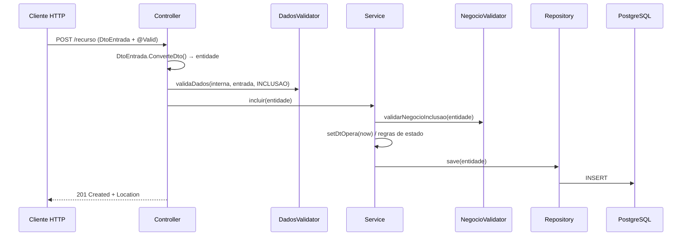
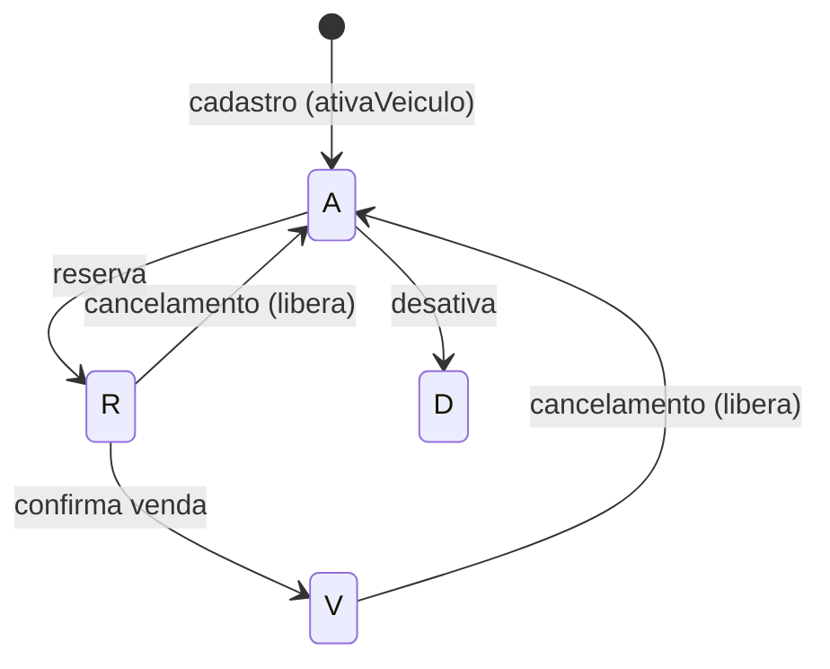
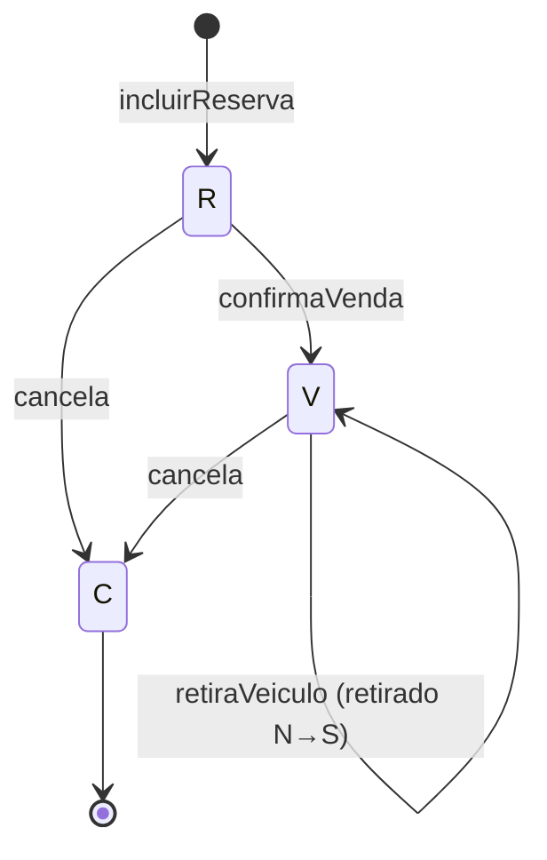

# Documentação Técnica — API de Revenda de Veículos

Documento de referência técnica do projeto. Complementa o [`README.md`](../README.md) (visão geral / como rodar) e o [`FASE5-Entregaveis.md`](FASE5-Entregaveis.md) (arquitetura em nuvem, segurança de dados e SAGA).

## Índice

1. [Visão geral](#1-visão-geral)
2. [Organização do código](#2-organização-do-código)
3. [Fluxo de uma requisição](#3-fluxo-de-uma-requisição)
4. [Modelo de dados](#4-modelo-de-dados)
5. [Máquinas de estado](#5-máquinas-de-estado)
6. [Regras de negócio](#6-regras-de-negócio)
7. [Referência da API](#7-referência-da-api)
8. [Contratos (DTOs)](#8-contratos-dtos)
9. [Tratamento de erros](#9-tratamento-de-erros)
10. [Configuração](#10-configuração)
11. [Segurança](#11-segurança)
12. [Análise técnica e pontos de atenção](#12-análise-técnica-e-pontos-de-atenção)

---

## 1. Visão geral

API REST em **Spring Boot 4.1 / Java 21** para uma revenda de veículos. Cobre três blocos:

- **Catálogo** — dados de referência: `Marca`, `Modelo`, `Versao`, `Cor`.
- **Estoque** — `Veiculo` (associado a uma versão e a uma cor).
- **Compra** — `Cliente` (comprador) e `ReservaVendaVeiculo` (a transação que conduz reserva → venda → retirada, ou cancelamento).

Persistência com Spring Data JPA/Hibernate sobre PostgreSQL. Auditoria de data via `@EntityListeners(AuditingEntityListener.class)` e `@EnableJpaAuditing`.

## 2. Organização do código

Pacote raiz: `com.example.veiculo`

| Pacote | Responsabilidade |
|---|---|
| `controller` | Endpoints REST (um controller por agregado). |
| `controller.validator` | Validação de **dados** (formato, obrigatoriedade, integridade de entrada). |
| `service` | Regras de negócio e transações (`@Transactional`). |
| `service.validator` | Validação de **negócio** (transições de estado, duplicidade, integridade referencial). |
| `repository` | Interfaces Spring Data JPA; *native queries* para relatórios agregados. |
| `model` | Entidades JPA. |
| `dto.<Agregado>` | `...DtoEntrada` (records com Bean Validation) e `...DtoSaida`. |
| `geral.config` | `SecurityConfiguration`, `Libs` (utilitários), exceções. |
| `geral.config.exception` | `GlobalExceptionHandler`, `Problem`, `ProblemType`, exceções personalizadas. |
| `geral.generic` | `GenerciController` (geração de header `Location`). |

Padrão de nomenclatura por agregado: `XxxController` → `XxxDadosValidator` → `XxxService` → `XxxNegocioValidator` → `XxxRepository` → `Xxx` (model), com `XxxDtoEntrada`/`XxxDtoSaida`.

## 3. Fluxo de uma requisição

Exemplo de inclusão (`POST`), válido para todos os agregados:



- **Bean Validation (`@Valid`)** dispara nas `record`s de entrada; erros vão para `handleMethodArgumentNotValid`.
- **DadosValidator** roda regras de borda antes do serviço.
- **NegocioValidator** roda dentro do serviço, na transação.

## 4. Modelo de dados

### Entidades de catálogo

| Entidade | Campos | Observações |
|---|---|---|
| `Marca` | `id`, `nome` (único), `dtOpera` | Raiz do catálogo. |
| `Modelo` | `id`, `nome` (único), `marca` (ManyToOne), `dtOpera` | Pertence a uma marca. |
| `Versao` | `id`, `nome` (único), `modelo` (ManyToOne), `dtOpera` | Pertence a um modelo. |
| `Cor` | `id`, `nome` (único), `dtOpera` | Independente. |

### Estoque

| `Veiculo` | Tipo | Observações |
|---|---|---|
| `id` | Long | PK |
| `status` | String(1) | `A`/`R`/`V`/`D` |
| `anoFabricacao` | Short | |
| `anoModelo` | Short | |
| `chassi` | String(17) | |
| `valor` | BigDecimal(9,2) | |
| `versao` | Versao (ManyToOne, LAZY) | obrigatório |
| `cor` | Cor (ManyToOne, LAZY) | obrigatório |
| `dtOpera` | OffsetDateTime | data da operação |

### Comprador

| `Cliente` | Tipo | Classificação LGPD |
|---|---|---|
| `id` | Long | — |
| `nome` | String(70), **único** | Pessoal |
| `cpf` | String(15) | **Pessoal crítico** |
| `logradouro`,`numero`,`complemento`,`bairro`,`cidade`,`estado`,`cep` | String | Pessoal (endereço) |
| `celular`,`foneFixo`,`email` | String | Pessoal (contato) |
| `dtOpera` | OffsetDateTime | — |

### Transação de compra

| `ReservaVendaVeiculo` | Tipo | Observações |
|---|---|---|
| `id` | Long | "código da reserva" retornado no POST |
| `status` | String(1) | `R`/`V`/`C` |
| `valor` | BigDecimal(9,2) | deve bater com o valor do veículo |
| `cliente` | Cliente (ManyToOne) | obrigatório |
| `veiculo` | Veiculo (ManyToOne) | obrigatório |
| `dtReserva`,`dtVenda`,`dtCancelamento`,`dtRetirada` | OffsetDateTime | marcos do processo |
| `retirado` | String(1) | `S`/`N` |
| `dtOpera` | OffsetDateTime | data da operação |

Métodos de conveniência da entidade: `reservaVeiculo()`, `vendaVeiculo()`, `cancelaVeiculo()`, `retiradaVeiculo()`.

## 5. Máquinas de estado

### Veículo



### Reserva/Venda



## 6. Regras de negócio

Concentradas em `ReservaVendaVeiculoNegocioValidator` e `ReservaVendaVeiculoService`:

**Inclusão de reserva (`validarNegocioInclusao`)**
- Veículo deve existir (`veiculoRepository.existsById`).
- Cliente deve existir (`clienteRepository.existsById`) → atende "venda somente para compradores cadastrados".
- Valor informado deve ser igual ao valor cadastrado do veículo.
- Não pode haver reserva `R` nem venda `V` para o mesmo veículo.
- Ao reservar: `Reserva.status = R`, `retirado = N`, `dtReserva = now`; o `Veiculo` passa a `R`.

**Alteração (`validarNegocioAlteracao`)**
- Mesmas validações de integridade; só permite alterar reservas com status `R`.

**Confirmação de venda (`confirmaVenda`)**
- Só permite quando status atual é `R`; grava `dtVenda`, `Reserva.status = V` e `Veiculo.status = V`.

**Retirada (`retiraVeiculo`)**
- Só permite quando status é `V` e ainda não retirado; marca `retirado = S`.

**Cancelamento (`cancela`)**
- Só permite quando status é `R` (ou `V`, conforme validação); grava `dtCancelamento`, `Reserva.status = C` e devolve o `Veiculo` para `A` (`ativaVeiculo`).

> As operações de compra usam `@Transactional`, garantindo atomicidade entre a atualização da reserva e do veículo.

## 7. Referência da API

Base: `http://localhost:8083`

### Recursos de catálogo (CRUD idêntico)

`/marcas`, `/modelos`, `/versoes`, `/cores`:

| Método | Rota | Status sucesso |
|---|---|---|
| GET | `/{recurso}` | 200 |
| GET | `/{recurso}/{id}` | 200 / 404 |
| POST | `/{recurso}` | 201 + `Location` |
| PUT | `/{recurso}/{id}` | 204 / 404 |
| DELETE | `/{recurso}/{id}` | 204 / 404 |

### `/veiculos`

| Método | Rota | Descrição |
|---|---|---|
| GET | `/veiculos` | Lista todos |
| GET | `/veiculos/{id}` | Obtém por id |
| GET | `/veiculos/a-venda` | Somente disponíveis (`status = A`) |
| POST | `/veiculos` | Inclui (201 + Location) |
| PUT | `/veiculos/{id}` | Altera (204) |
| DELETE | `/veiculos/{id}` | Exclui (204) |

### `/clientes`

| Método | Rota | Descrição |
|---|---|---|
| GET | `/clientes` | Lista |
| GET | `/clientes/{id}` | Obtém |
| POST | `/clientes` | Inclui (201 + Location) |
| PUT | `/clientes/{id}` | Altera (204) |
| DELETE | `/clientes/{id}` | Exclui (204) |

### `/reserva-venda-veiculos`

**Comandos do processo**

| Método | Rota | Efeito |
|---|---|---|
| POST | `/` | Cria reserva; retorna `201` com corpo `"Código da Reserva: {id}"` |
| PUT | `/{id}` | Altera reserva (204) |
| DELETE | `/confirma-venda/{id}` | Confirma venda (204) |
| DELETE | `/retira-veiculo/{id}` | Registra retirada (204) |
| DELETE | `/{id}` | Cancela (204) |

**Consultas (ordenadas por preço)**

| Método | Rota | Descrição |
|---|---|---|
| GET | `/` | Todas (reservados/vendidos/cancelados) |
| GET | `/{id}` | Uma reserva |
| GET | `/reservados` | Status `R` |
| GET | `/vendidos` | Status `V` |
| GET | `/cancelados` | Status `C` |
| GET | `/pendentes-de-retirada` | `V` e `retirado = N` |
| GET | `/retirados` | `V` e `retirado = S` |

**Relatórios de estoque (native queries)**

| Método | Rota | Descrição |
|---|---|---|
| GET | `/marca` | Agregado por marca (disponível/reservada/vendida/total) |
| GET | `/marca-modelo` | Agregado por marca+modelo |
| GET | `/marca-modelo-versao` | Agregado por marca+modelo+versão |
| GET | `/marca-modelo-versao-qtde-estoque` | Quantidade disponível (`status = A`) por versão |

## 8. Contratos (DTOs)

### `VeiculoDtoEntrada`

```json
{
  "corId": 1,
  "versaoId": 1,
  "anoFabricacao": 2023,
  "anoModelo": 2024,
  "chassi": "9BWZZZ377VT004251",
  "valor": 89900.00
}
```
Validações: `corId`/`versaoId` obrigatórios; `chassi` entre 10 e 17; `valor` até 9 inteiros e 2 decimais.

### `ClienteDtoEntrada`

```json
{
  "nome": "Maria Silva",
  "cpf": "12345678901",
  "logradouro": "Rua A", "numero": "100", "complemento": "Apto 1",
  "bairro": "Centro", "cidade": "São Paulo", "estado": "SP", "cep": "01001000",
  "celula": "11999998888", "foneFixo": "1133334444",
  "email": "maria@exemplo.com"
}
```
Validações: `nome` obrigatório (2–70); demais campos com limites de tamanho; `cep` com 8 posições. *(atenção: o campo do celular chama-se `celula` no DTO — ver §12)*.

### `ReservaVendaVeiculoDtoEntrada`

```json
{ "veiculoId": 1, "clienteId": 1, "valor": 89900.00 }
```
Validações: `veiculoId` e `clienteId` obrigatórios; `valor` até 9 inteiros e 2 decimais.

## 9. Tratamento de erros

Centralizado em `GlobalExceptionHandler` (`@RestControllerAdvice`), que estende `ResponseEntityExceptionHandler`.

| Exceção | HTTP | Uso |
|---|---|---|
| `RegistroDuplicadoException` | 409 | Registro já existente |
| `RegistroSemIntegridadeException` | 409 | Integridade de negócio violada |
| `RegistroNaoEncontradoException` | 400 | ID/registro inexistente |
| `RegistroNaoEnviadoException` | 400 | Campo obrigatório ausente |
| `CampoInvalidoException` | 400 (payload 422) | Campo inválido |
| `OperacaoNaoPemitidaExecption` | 400 | Operação não permitida |
| `ErroGeralException` | 409 | Regra de negócio genérica |
| `AccessDeniedException` / `AuthorizationDeniedException` | 403 | Acesso negado |
| `DataIntegrityViolationException` | 400 | Violação de constraint no banco |
| `MethodArgumentNotValidException` | (status do binding) | Erros de Bean Validation com lista de campos |
| `RuntimeException` | 500 | Erro não tratado |

Erros de validação retornam um `Problem` com a lista de campos e mensagens amigáveis (via `MessageSource`). Existe suporte a placeholder `{ordem}` para mensagens que dependem de posição.

## 10. Configuração

`src/main/resources/application.yml` (valores atuais):

| Propriedade | Valor |
|---|---|
| `server.port` | `8083` |
| `spring.datasource.url` | `jdbc:postgresql://localhost:5433/veiculos` |
| `spring.datasource.username/password` | `postgres` / `postgres` |
| `spring.jpa.hibernate.ddl-auto` | `update` |
| `spring.jpa.show-sql` | `true` |
| `spring.servlet.multipart.max-file-size` | `10MB` |
| logging | `org.hibernate.SQL: DEBUG`, `binder: TRACE` |

> Em produção: definir `ddl-auto: validate` (com migrações via Flyway/Liquibase), desligar `show-sql` e mover credenciais para variáveis de ambiente/secret manager.

## 11. Segurança

- Dependência `spring-boot-starter-security` presente.
- `SecurityConfiguration` habilita `@EnableWebSecurity`, `@EnableMethodSecurity(securedEnabled=true, jsr250Enabled=true)` e `@EnableJpaAuditing`.
- **Estado atual:** `SecurityFilterChain` com `csrf disabled` e `anyRequest().permitAll()` — **a API está aberta**. Há um bean comentado que restringia rotas.

Recomendações detalhadas no [relatório de segurança da FASE 5](FASE5-Entregaveis.md#2-relatório-de-segurança-de-dados): autenticação JWT/Cognito, RBAC por método (`@PreAuthorize`), criptografia/mascaramento de dados sensíveis e segregação de rede.

## 12. Análise técnica e pontos de atenção

Pontos observados na análise do código (não bloqueantes, mas recomendados):

1. **API aberta:** `anyRequest().permitAll()` expõe todos os endpoints, inclusive dados pessoais de clientes. Prioridade alta.
2. **Chave de unicidade do cliente:** `Cliente.nome` é `unique`, mas o identificador natural deveria ser o **CPF** (hoje `length = 15`, sem `unique` e sem validação de dígitos). Impede dois clientes homônimos.
3. **Handler genérico de `Exception`:** retorna `@ResponseStatus(HttpStatus.NO_CONTENT)` (204) para qualquer `Exception`, o que pode mascarar erros como sucesso. Avaliar retornar 4xx/5xx.
4. **Typos de nomenclatura:** pacote `dto.ReervaVendaVeiculo`, exceção `OperacaoNaoPemitidaExecption`, classe `GenerciController`, campo `celula` no DTO de cliente. Não afetam o funcionamento, mas prejudicam manutenção.
5. **Consistência de ordenação:** alguns métodos combinam `findBy...OrderByValorAsc(...)` com `Sort.by("id")`; verificar qual ordenação prevalece.
6. **Segredos em texto plano** no `application.yml`.
7. **Sem código de pagamento / timeout de reserva:** o processo previsto no case (código de pagamento, expiração da reserva) ainda não está implementado — ver desenho SAGA na FASE 5.
8. **Ausência de testes** automatizados e de documentação OpenAPI/Swagger.

Melhorias sugeridas priorizadas: (1) segurança de acesso → (2) proteção de dados sensíveis → (3) código de pagamento + SAGA → (4) qualidade (nomes, testes, OpenAPI).
