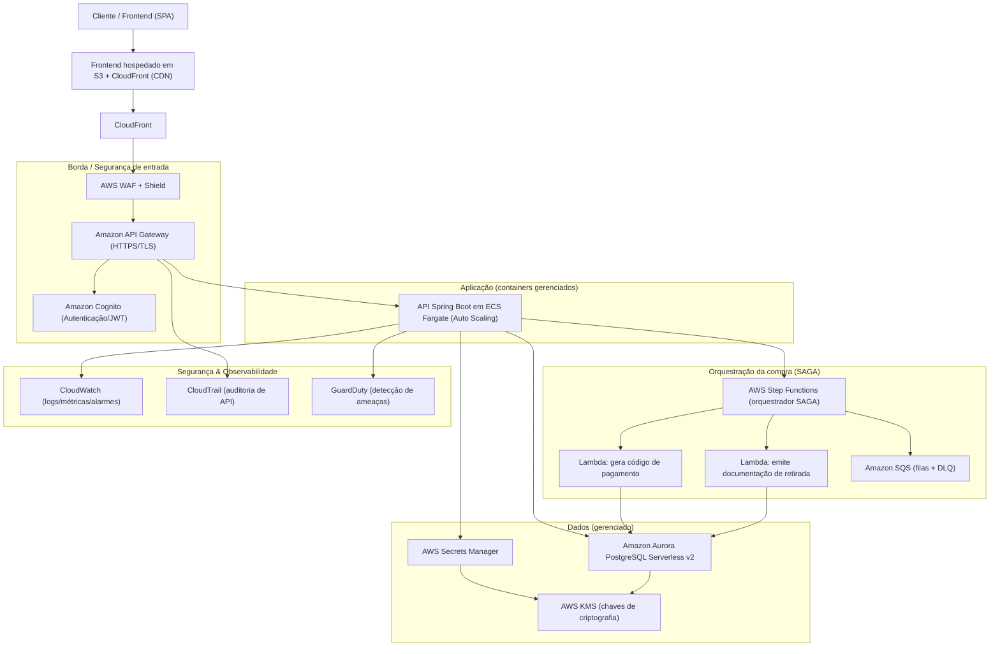
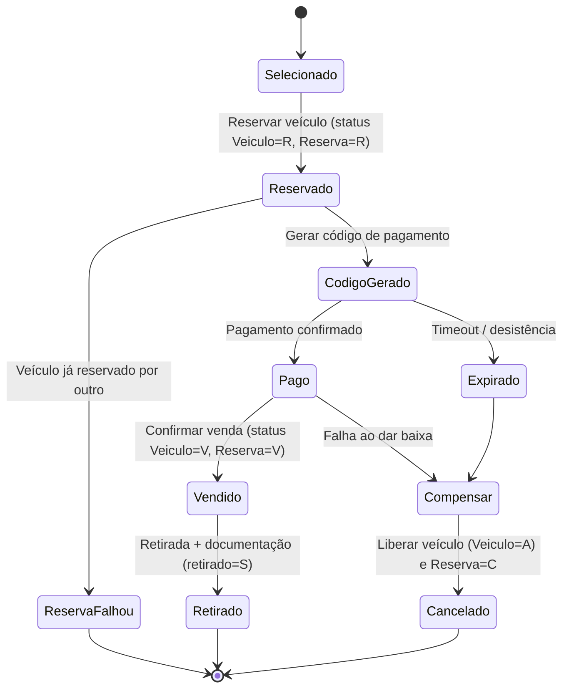

# FASE 5 — Plataforma de Revenda de Veículos

**Projeto:** API de Revenda de Veículos (Spring Boot 4.1 / Java 21 / PostgreSQL)
**Repositório:** _<inserir link do GitHub aqui>_
**Autor:** _<seu nome>_

Este documento reúne os entregáveis solicitados na FASE 5:

1. Desenho da arquitetura em nuvem (com priorização de serviços serverless/gerenciados e serviços de segurança).
2. Relatório de segurança de dados.
3. Relatório de orquestração SAGA.

> Observação: os diagramas estão em [Mermaid](https://mermaid.js.org/). Ao exportar para PDF (ex.: extensão *Markdown PDF* do VS Code, ou colando no [mermaid.live](https://mermaid.live)), os diagramas são renderizados automaticamente.

---

## Contexto e modelagem atual da solução

A API já implementa o domínio de negócio da revenda. As entidades relevantes são:

| Entidade | Principais campos | Função |
|---|---|---|
| `Marca`, `Modelo`, `Versao`, `Cor` | descrição / relacionamentos | Dados de referência (catálogo) |
| `Veiculo` | `status` (A/R/V/D), `anoFabricacao`, `anoModelo`, `chassi`, `valor`, `versao`, `cor` | Estoque de veículos à venda |
| `Cliente` | `nome`, `cpf`, endereço completo, `celular`, `foneFixo`, `email` | Comprador cadastrado |
| `ReservaVendaVeiculo` | `status` (R/V/C), `valor`, `cliente`, `veiculo`, `dtReserva`, `dtVenda`, `dtCancelamento`, `retirado` (S/N), `dtRetirada` | Transação que conduz o processo de compra |

O **processo de compra** é conduzido pela entidade `ReservaVendaVeiculo` e transita por estados que espelham exatamente o fluxo descrito no case:

```
seleção → reserva (R) → código de pagamento → pagamento → venda (V) → retirada (retirado = S)
                     └────────────── cancelamento (C) em qualquer etapa ───────────────┘
```

Os endpoints já cobrem: inclusão de reserva (`POST /reserva-venda-veiculos`), confirmação de venda (`DELETE /confirma-venda/{id}`), retirada (`DELETE /retira-veiculo/{id}`), cancelamento (`DELETE /{id}`) e as listagens ordenadas por preço (`/reservados`, `/vendidos`, `/cancelados`, `/pendentes-de-retirada`, `/retirados`).

A partir desse ponto, a FASE 5 define **como esse sistema deve rodar em nuvem, como os dados sensíveis são protegidos e como o processo de compra deve ser orquestrado de forma resiliente (SAGA)**.

---

## 1. Desenho da Arquitetura em Nuvem

### 1.1. Princípios adotados

- **Serverless e gerenciado primeiro:** minimizar operação de infraestrutura (patching, escalonamento, alta disponibilidade), pagando por uso e escalando conforme a demanda do e‑commerce.
- **Segurança por padrão (*security by design* e *defense in depth*):** criptografia em trânsito e em repouso, segregação de rede, gestão centralizada de segredos e de identidade.
- **Observabilidade e auditoria** desde o início, exigência reforçada pelo tratamento de dados pessoais (LGPD).

> A referência de provedor é a **AWS**, mas há equivalência direta em Azure e GCP (tabela na seção 1.5).

### 1.2. Diagrama da arquitetura (AWS)



### 1.3. Serviços escolhidos e justificativas

| Camada | Serviço (AWS) | Por que (justificativa) |
|---|---|---|
| **CDN + Frontend** | **S3 + CloudFront** | Hospedagem estática do SPA do time de UX/frontend com baixa latência global, cache e HTTPS gerenciado. Serverless, custo por uso. |
| **Proteção de borda** | **AWS WAF + Shield** | Bloqueia OWASP Top 10 (SQLi, XSS), rate limiting e mitigação de DDoS antes de chegar à aplicação. Gerenciado, com regras atualizadas pela AWS. |
| **API Gateway** | **Amazon API Gateway** | Ponto único de entrada, encerra TLS, aplica *throttling*, valida token JWT e integra nativamente com Cognito. Reduz superfície de exposição da aplicação. |
| **Autenticação/Autorização** | **Amazon Cognito** | Gerência de identidade gerenciada (login, MFA, emissão de JWT/OAuth2). Essencial para a regra "venda somente para compradores cadastrados". Evita implementar e operar auth próprio. |
| **Aplicação** | **Amazon ECS Fargate** | A aplicação é um Spring Boot (JVM) já pronto; Fargate roda containers **sem gerenciar servidores**, com auto scaling e alta disponibilidade multi‑AZ. Preferido a EC2 (operação) e mais adequado que Lambda para uma JVM de longa duração (evita *cold start* e limite de 15 min). |
| **Orquestração da compra** | **AWS Step Functions** | Orquestra a SAGA (reserva → pagamento → venda → retirada) com controle de estado, *timeouts*, *retries* e passos de compensação nativos. (Detalhes na seção 3.) |
| **Funções pontuais** | **AWS Lambda** | Tarefas curtas e event‑driven: gerar código de pagamento e emitir documentação de retirada. Serverless, escala a zero, custo por execução. |
| **Mensageria** | **Amazon SQS (+ DLQ)** | Desacopla passos assíncronos (ex.: confirmação de pagamento) e garante processamento *at‑least‑once*; a *Dead Letter Queue* isola mensagens com falha para reprocesso. |
| **Banco de dados** | **Amazon Aurora PostgreSQL Serverless v2** | Compatível com o PostgreSQL já usado no projeto. Gerenciado (backup, patch, réplicas), escala automaticamente a capacidade e oferece criptografia em repouso via KMS. |
| **Segredos** | **AWS Secrets Manager** | Armazena credenciais de banco e chaves de integração fora do código/`application.yml`, com rotação automática. |

### 1.4. Serviços de segurança da nuvem (e justificativa do uso)

| Serviço | Uso na solução | Justificativa |
|---|---|---|
| **AWS KMS** | Chaves para criptografar Aurora, S3, SQS, Secrets e campos sensíveis (envelope encryption). | Centraliza a gestão do ciclo de vida das chaves, com rotação e trilha de auditoria de uso — requisito para dados pessoais (LGPD). |
| **AWS IAM** | Permissões mínimas (*least privilege*) por serviço/role. | Garante que cada componente só acesse o que precisa; segrega funções (ex.: Lambda de documentação não altera estoque). |
| **Amazon Cognito** | Autenticação de compradores e emissão de JWT. | Atende "venda somente para compradores cadastrados" e habilita MFA para operações sensíveis. |
| **AWS WAF + Shield** | Filtro de aplicação e anti‑DDoS. | Protege a API pública contra ataques automatizados e injeção. |
| **AWS CloudTrail** | Registro imutável de todas as chamadas de API da conta. | Auditoria e resposta a incidentes; evidência de quem acessou o quê. |
| **Amazon CloudWatch** | Logs, métricas e alarmes. | Detecção de anomalias (picos de erro/latência) e base para auditoria operacional. |
| **Amazon GuardDuty** | Detecção contínua de ameaças. | Identifica acessos anômalos/credenciais comprometidas sem esforço operacional. |
| **VPC + Security Groups + Subnets privadas** | Aurora e Fargate em subnets privadas; acesso ao banco só a partir da aplicação. | Isolamento de rede; o banco de dados nunca é exposto à internet. |

### 1.5. Equivalência entre provedores

| Função | AWS | Azure | GCP |
|---|---|---|---|
| API/Gateway | API Gateway | API Management | API Gateway / Apigee |
| Identidade | Cognito | Entra ID B2C | Identity Platform |
| Containers gerenciados | ECS Fargate | Container Apps | Cloud Run |
| Funções | Lambda | Azure Functions | Cloud Functions |
| Orquestração SAGA | Step Functions | Logic Apps / Durable Functions | Workflows |
| Banco relacional | Aurora Serverless | Azure DB for PostgreSQL Flexible | Cloud SQL / AlloyDB |
| Segredos | Secrets Manager | Key Vault | Secret Manager |
| Chaves | KMS | Key Vault | Cloud KMS |
| WAF | AWS WAF | Azure WAF | Cloud Armor |

---

## 2. Relatório de Segurança de Dados

### 2.1. Dados armazenados pela solução

| Entidade | Campos | Classificação |
|---|---|---|
| `Cliente` | `nome` | Pessoal |
| | `cpf` | **Pessoal sensível / crítico** (identificador único) |
| | `logradouro`, `numero`, `complemento`, `bairro`, `cidade`, `estado`, `cep` | **Pessoal** (endereço) |
| | `celular`, `foneFixo`, `email` | **Pessoal** (contato) |
| `Veiculo` | `chassi`, `valor`, `anoFabricacao`, `anoModelo`, `versao`, `cor`, `status` | Operacional / não pessoal |
| `ReservaVendaVeiculo` | `valor`, `status`, `dtReserva`, `dtVenda`, `dtCancelamento`, `dtRetirada`, `retirado`, vínculo `cliente`/`veiculo` | Operacional; torna‑se **pessoal por associação** (liga um comprador a uma compra) |
| `Marca`, `Modelo`, `Versao`, `Cor` | descrições | Referência / público |
| (novo) **Código de pagamento** | código, valor, validade, status | **Financeiro sensível** |

### 2.2. Quais são os dados sensíveis

Sob a ótica da **LGPD**, todos os campos da entidade `Cliente` são **dados pessoais**. Os de maior criticidade:

- **CPF** — identificador direto; alvo preferencial de fraude. Necessário para emitir o código de pagamento e a documentação do veículo.
- **Endereço completo** — necessário para a documentação de retirada; permite localização física do titular.
- **Contatos (email, celular, fone)** — vetor de *phishing* e engenharia social.
- **Código/dados de pagamento** — dado financeiro; exige proteção reforçada e menor tempo de retenção.

> Observação sobre o modelo atual: a coluna `cpf` está com tamanho 15 e sem restrição de unicidade; o campo único hoje é `nome`. Recomenda‑se tornar o **CPF único e validado**, e **não** usar `nome` como chave única.

### 2.3. Políticas de acesso a dados implementadas / recomendadas

1. **Autenticação obrigatória (Cognito + JWT):** hoje o `SecurityConfiguration` está com `anyRequest().permitAll()` (aberto). Deve passar a exigir token válido em todos os endpoints, exceto catálogo público de veículos à venda.
2. **Autorização por papel (RBAC):**
   - `CLIENTE`: cria/consulta apenas as próprias reservas; não vê dados de outros clientes.
   - `VENDEDOR`/`OPERADOR`: opera estoque, confirma venda e retirada.
   - `ADMIN`: gestão completa e acesso a auditoria.
   O projeto já habilita `@EnableMethodSecurity`; basta anotar os métodos (`@PreAuthorize`).
3. **Regra de negócio "venda só para cadastrado":** já validada em `ReservaVendaVeiculoNegocioValidator` (`clienteRepository.existsById`). Deve ser reforçada com o vínculo ao usuário autenticado.
4. **Princípio do menor privilégio (IAM):** cada serviço (Fargate, Lambdas) recebe apenas as permissões necessárias no banco e nas filas.
5. **Mascaramento na saída:** DTOs de saída devem mascarar CPF (`***.***.***-12`) e contatos para perfis sem necessidade de vê‑los; log **nunca** registra dado pessoal em claro.
6. **Segregação de rede:** banco em subnet privada, acessível somente pela aplicação.

### 2.4. Políticas de segurança da operação (tratamento dos dados)

- **Criptografia em trânsito:** TLS 1.2+ obrigatório (CloudFront → API Gateway → Fargate).
- **Criptografia em repouso:** Aurora, S3, SQS e Secrets criptografados com **KMS**. Para CPF e código de pagamento, aplicar criptografia adicional em nível de campo (envelope encryption).
- **Gestão de segredos:** credenciais fora do `application.yml`, em **Secrets Manager**, com rotação automática.
- **Minimização e finalidade (LGPD):** coletar apenas o necessário para pagamento e documentação; definir base legal (execução de contrato).
- **Retenção e descarte:** política de expurgo — código de pagamento expira; dados de clientes que desistiram/cancelaram são anonimizados após prazo legal.
- **Auditoria/rastreabilidade:** `CloudTrail` + logs de aplicação registram *quem* acessou dado pessoal, *quando* e *por quê*. O campo `dtOpera` já existe nas entidades e ajuda na trilha.
- **Backup e recuperação:** *point‑in‑time recovery* do Aurora; testes periódicos de restauração.
- **Resposta a incidentes:** GuardDuty + alarmes CloudWatch acionam o plano de resposta; notificação à ANPD e aos titulares quando aplicável.

### 2.5. Riscos e ações de mitigação

| # | Risco | Impacto | Mitigação |
|---|---|---|---|
| 1 | **API aberta** (`permitAll`) expõe dados pessoais | Alto | Habilitar autenticação (Cognito/JWT) + autorização por método (`@PreAuthorize`). |
| 2 | Vazamento de **CPF/endereço** | Alto (LGPD, fraude) | Criptografia de campo (KMS), mascaramento na saída, acesso mínimo, logs sem PII. |
| 3 | **SQL Injection / XSS** | Alto | JPA/consultas parametrizadas (já usado), Bean Validation (já usado) e WAF na borda. |
| 4 | **Credenciais no código/config** | Alto | Secrets Manager + rotação; remover senha do `application.yml`. |
| 5 | **Reserva concorrente** (dois clientes no mesmo veículo) | Médio | Trava otimista/pessimista no `Veiculo` + verificação de status na reserva (já há checagem de status "R"/"V"). |
| 6 | **Pagamento não efetuado / desistência** | Médio | *Timeout* de reserva na SAGA com compensação (libera veículo). |
| 7 | **Perda de dados** | Alto | Backups automatizados, multi‑AZ, testes de restauração. |
| 8 | **Acesso indevido interno** | Médio | RBAC, IAM least privilege, CloudTrail e revisão de acessos. |
| 9 | **Ataque de negação de serviço** | Médio | WAF + Shield + throttling no API Gateway. |
| 10 | **Retenção excessiva de dados** | Médio (LGPD) | Política de retenção/expurgo e anonimização de compras canceladas. |

---

## 3. Relatório de Orquestração SAGA

### 3.1. Por que SAGA neste problema

O processo de compra envolve **múltiplos passos e serviços** (reserva de estoque, geração de código de pagamento, confirmação de pagamento, baixa de estoque, emissão de documentação) que precisam ser **consistentes** mesmo com falhas parciais (outro cliente reservou antes, pagamento não efetuado, desistência). Em uma arquitetura distribuída/serverless não há uma transação ACID única entre serviços; por isso usa‑se o padrão **SAGA**, uma sequência de transações locais em que cada passo tem uma **transação de compensação** para desfazer efeitos anteriores.

### 3.2. Tipo de SAGA recomendado: **Orquestração**

Existem dois estilos:

- **Coreografia:** cada serviço reage a eventos, sem coordenador central. Simples para poucos passos, mas o fluxo fica "espalhado", difícil de monitorar e com risco de dependências cíclicas conforme cresce.
- **Orquestração:** um **orquestrador central** comanda a ordem dos passos e dispara as compensações.

**Escolha: SAGA por Orquestração, usando AWS Step Functions.**

**Justificativa:**

1. **Fluxo com estados bem definidos e sequenciais** (reserva → pagamento → venda → retirada) — encaixa naturalmente numa máquina de estados.
2. **Compensações explícitas e críticas** (liberar veículo, cancelar reserva, expirar código de pagamento) — mais seguras e fáceis de garantir com um coordenador central.
3. **Timeouts e desistência** — a reserva precisa expirar se o pagamento não ocorrer; Step Functions oferece *wait/timeout* e *retry* nativos.
4. **Observabilidade e auditoria** — o orquestrador dá visão ponta a ponta de cada compra (essencial para suporte e para a trilha de auditoria de dados pessoais).
5. **Evolução** — novos passos (ex.: análise antifraude) entram sem reescrever a lógica distribuída de eventos.

### 3.3. Fluxo da SAGA (com compensações)



### 3.4. Passos e transações de compensação

| Passo (transação local) | Efeito | Compensação |
|---|---|---|
| **Reservar veículo** | `Veiculo.status = R`, cria `ReservaVendaVeiculo` com status `R` | Cancelar reserva: `Reserva.status = C`, `Veiculo.status = A` |
| **Gerar código de pagamento** | cria código com validade | Expirar/invalidar código |
| **Confirmar pagamento** | marca pagamento OK | Estornar/registrar falha e disparar cancelamento |
| **Confirmar venda** | `Reserva.status = V`, `Veiculo.status = V` | Reverter para `A`/`C` se etapa seguinte falhar |
| **Retirada + documentação** | `retirado = S`, `dtRetirada` | (passo final; sem compensação — emite documento) |

Esse mapeamento corresponde diretamente aos métodos já existentes em `ReservaVendaVeiculoService` (`incluirReserva`, `confirmaVenda`, `retiraVeiculo`, `cancela`) e aos estados de `Veiculo` (`ativaVeiculo`, `reservaVeiculo`, `vendaVeiculo`) — a orquestração apenas coordena esses passos com timeouts e compensações automáticas.

### 3.5. Garantias

- **Idempotência:** cada passo deve ser idempotente (reprocesso via SQS/DLQ não duplica efeitos).
- **Consistência eventual:** o sistema converge para "vendido/retirado" ou "cancelado com veículo liberado".
- **Sem estoque preso:** todo caminho de falha executa a compensação que devolve o veículo ao estoque (`status = A`).

---

## 4. Checklist de entrega

- [ ] Link do GitHub do código no topo deste documento.
- [ ] Exportar este arquivo para **PDF** (com os diagramas renderizados).
- [x] Desenho da arquitetura (serverless/gerenciados + segurança + justificativas).
- [x] Relatório de segurança de dados.
- [x] Relatório de orquestração SAGA.
